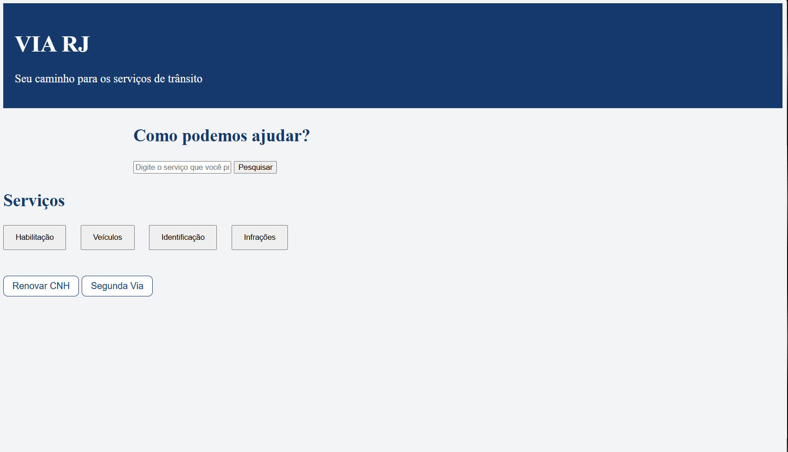
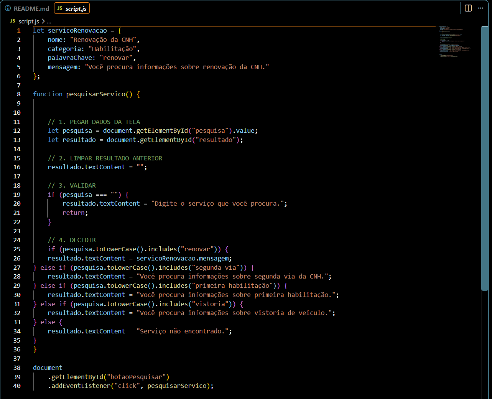

# VIA RJ 🚦

VIA RJ is a web development project created to apply programming concepts to a practical, real-world scenario involving access to public traffic-related services and information in Rio de Janeiro, Brazil.

The project evolved from an initial learning exercise focused on driver's license (CNH) scenarios into a broader web application developed progressively as part of my studies in Analysis and Systems Development.

> **Disclaimer:** VIA RJ is an independent academic and portfolio project. It is not an official DETRAN-RJ system and does not replace official government channels.

## 🌐 Live Demo

The current version of VIA RJ is available online through GitHub Pages:

👉 **[Open VIA RJ](https://rodpavao.github.io/via-rj/)**

The deployed version is updated as the project evolves.

## 📸 Project Preview

### VIA RJ Interface

The current interface provides a simple starting point for accessing and searching traffic-related services.

### JavaScript Logic

The application uses JavaScript for user input handling, validation, service search logic, DOM manipulation and event handling.

## 🎯 Project Objective

The main objective of VIA RJ is to develop a web application capable of organizing and simplifying access to information about traffic-related services.

The project is also a practical environment for applying software development concepts as I progress through my studies, gradually evolving from a basic front-end application toward a more structured system.

## 🛠️ Technologies

Currently used:

- HTML5
- CSS3
- JavaScript
- Visual Studio Code
- Git
- GitHub

Technologies and tools may be incorporated progressively as the project evolves.

## 💻 Current Features

The current version includes:

- Structured web interface
- Service search field
- User input handling
- Input validation
- Conditional logic
- Dynamic result display
- DOM manipulation
- JavaScript event handling
- Responsive interface styling
- Separation between HTML, CSS and JavaScript

The application is currently being expanded with new services and improvements to its interface and internal logic.

## 🧠 Concepts Applied

During the development of VIA RJ, I have been applying concepts such as:

- Variables and data types
- Conditional statements
- Comparison and logical operators
- Functions
- User input validation
- DOM manipulation
- Event listeners
- HTML semantic structure
- CSS styling and layout
- Separation of responsibilities between HTML, CSS and JavaScript
- Git version control
- Incremental software development

## 📂 Project Structure

The main application contains:

- `index.html` — page structure and content
- `style.css` — visual presentation and interface styling
- `script.js` — application logic and user interactions

The repository may also contain exercises and previous development material documenting the project's learning process.

## 🚧 Development Status

**VIA RJ is currently under active development.**

The project is being expanded incrementally as new programming concepts and technologies are studied and applied.

Future versions may include more advanced data handling, external data sources, back-end development and database integration.

## 📚 Learning Journey

VIA RJ is part of my practical learning journey in software development while studying Analysis and Systems Development.

Instead of treating programming concepts only as isolated exercises, the project provides a continuous environment where new knowledge can be applied to an evolving application.

This repository therefore documents both the development of the application and the progression of my technical skills.

## 👨‍💻 Author

**Rodrigo Pavão**

Analysis and Systems Development student focused on building practical experience in programming, software development and technology.
